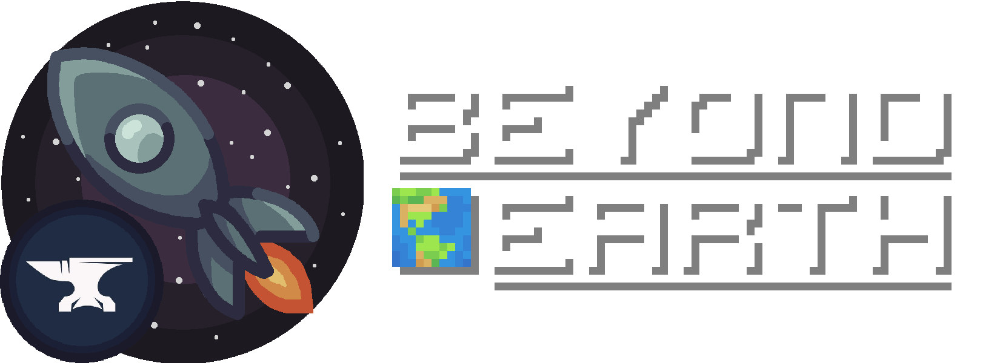

<a href="https://discord.gg/Xb2nPmN">
  

       
  

</a>

# Beyond Earth
Beyond Earth is a technology and space exploration mod for modern versions of Minecraft. It allows you to build rockets capable of space travel. You can explore multiple planets throughout the Solar System, build oxygenated space stations and bases and survive in space. You've always wanted to visit other planets, and now with Beyond Earth, you can fulfill your dreams of becoming an astronaut!

## Features
- Five planets/moons in two solar systems: Moon, Mars, Venus, Mercury and Glacio
- Vehicles: four different rocket tiers and a rover
- Machines: generators, refineries and workbenches to safely traverse space and build rockets
- 100+ blocks
- Oxygen management and a custom gravity system
- Guidebook for in-game documentation
- Many more features to discover yourself!
